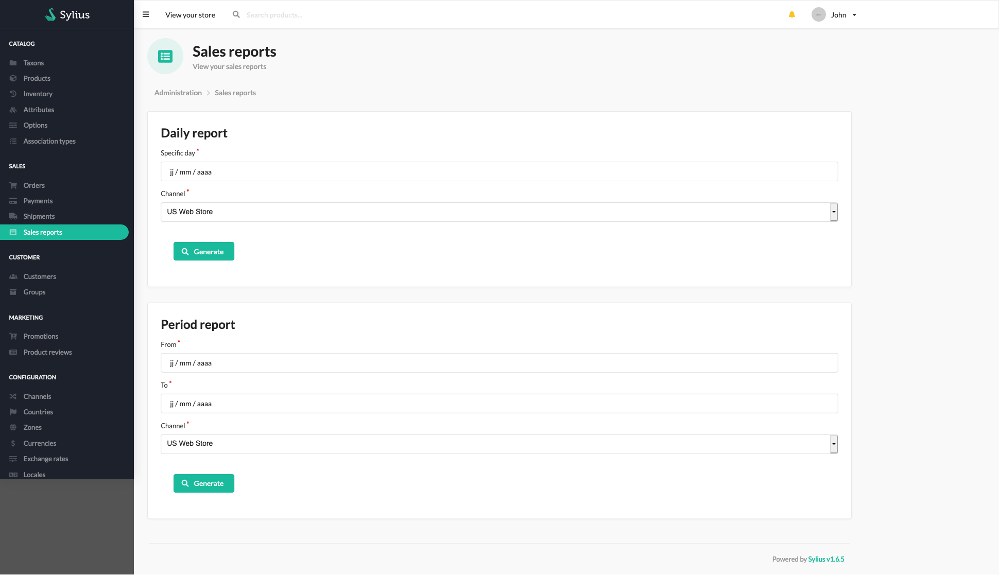
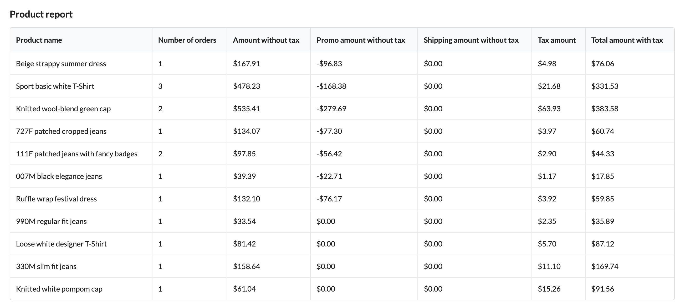
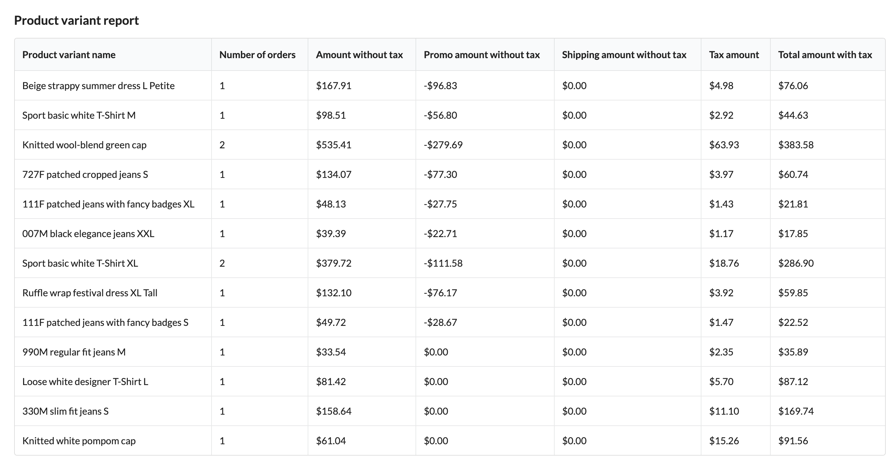
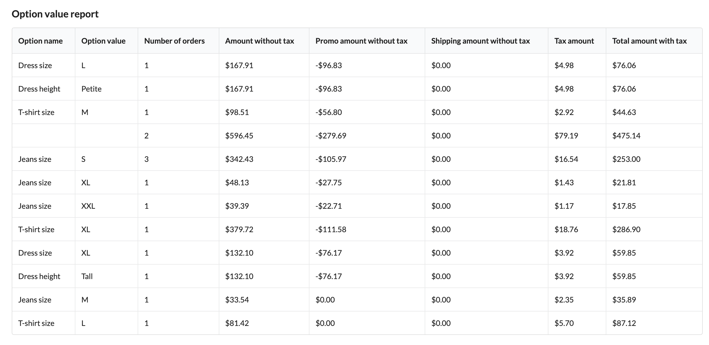

<p align="center">
    <a href="https://monsieurbiz.com" target="_blank">
        
    </a>
    &nbsp;&nbsp;&nbsp;&nbsp;
    <a href="https://sylius.com" target="_blank">
        
    </a>
</p>

<h1 align="center">Sales Reports</h1>

[](https://github.com/monsieurbiz/SyliusSalesReportsPlugin/blob/master/LICENSE.txt)
[](https://travis-ci.com/monsieurbiz/SyliusSalesReportsPlugin)
[](https://scrutinizer-ci.com/g/monsieurbiz/SyliusSalesReportsPlugin/?branch=master)

A simple plugin to have sales reports in Sylius



## Installation

```bash
composer require monsieurbiz/sylius-sales-reports-plugin
```

Change your `config/bundles.php` file to add the line for the plugin : 

```php
<?php

return [
    //..
    MonsieurBiz\SyliusSalesReportsPlugin\MonsieurBizSyliusSalesReportsPlugin::class => ['all' => true],
];
```

Then create the config file in `config/packages/monsieur_biz_sales_reports_plugin.yaml` :

```yaml
imports:
  - { resource: "@MonsieurBizSyliusSalesReportsPlugin/Resources/config/config.yaml" }
``` 


Finally import the routes in `config/routes.yaml` : 

```yaml
monsieur_biz_sales_reports_plugin:
    resource: "@MonsieurBizSyliusSalesReportsPlugin/Resources/config/routing.yaml"
```

## Reports

All reports columns are sortable by clicking on it.

### Global sales report


### Average sales report


### Product report



### Product variant report



### Option report


### Option value report



### Add your custom reports !

An event is available to add your custom reports, see `CustomReportEvent` class in the plugin.

## Contributing

You can open an issue or a Pull Request if you want! 😘  
Thank you!
